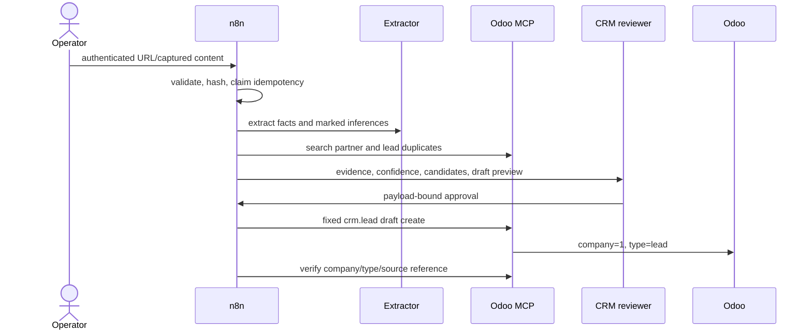
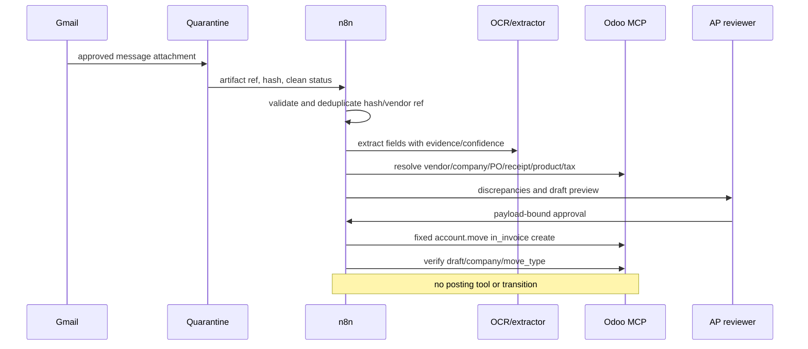
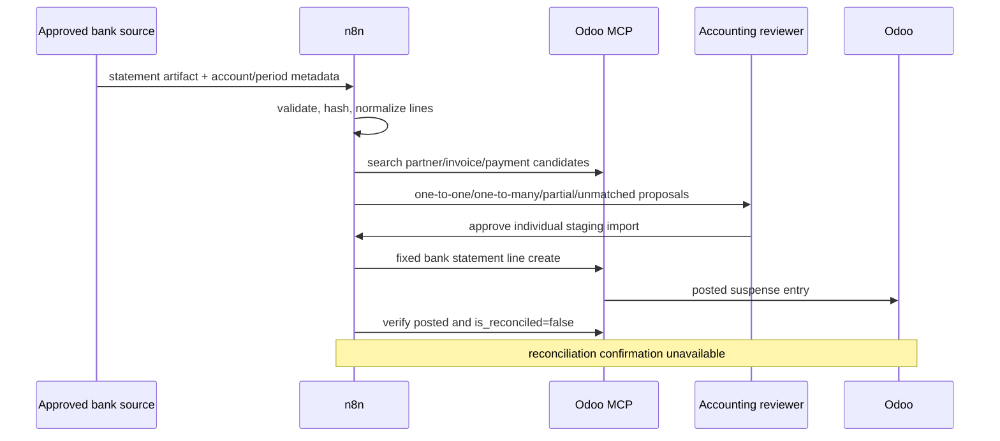
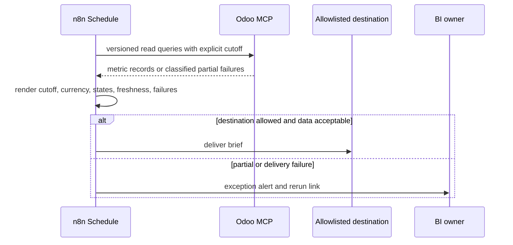
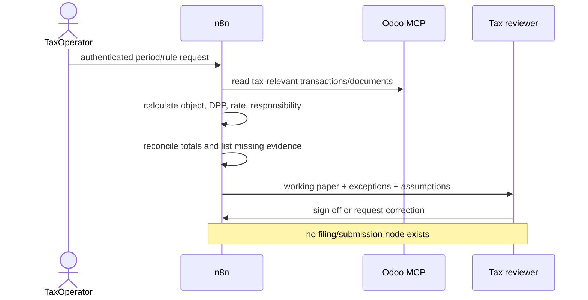

# Phase 8 Workflow Contracts

## Shared controls

Every input is authenticated, schema-versioned, assigned a UUID correlation
ID, and keyed by `sha256(canonical event type + trusted company + source
identity + content hash)`. `phase8.events.idempotency_key` is the atomic replay
barrier. The first execution claims it; duplicate and manual replay executions
return the stored state and never repeat an Odoo write.

External calls retry at most three times (2 s, 10 s, 30 s). Validation,
authorization, duplicate, and accounting discrepancies never retry. A timeout
after a possible write is `uncertain`, never retryable, until an operator
reconciles it to Odoo. Normal and error execution-data persistence is disabled;
the database audit contains identifiers and classifications, not email bodies,
documents, extracted payloads, or MCP results.

| Failure | Class | Action | Alert |
|---|---|---|---|
| timeout/429/502/503 before write | retryable | bounded retry, then exception | warning after exhaustion |
| schema/source/MIME/size/malware failure | permanent | quarantine + exception | owner immediately |
| unresolved match/low confidence/discrepancy | review | approval queue, no write | reviewer SLA |
| timeout/invalid response after write dispatch | uncertain | stop; reconcile in Odoo | critical immediately |
| denied ACL/company/tool | permanent security | stop + security exception | critical immediately |

Approval rows bind capability, canonical payload hash, reviewer role, expiry,
company, and idempotency key. Approval is single-use. Mutation, expiry,
rejection, or role mismatch denies the side effect. Structured approval payloads
are retained only in the restricted PostgreSQL schema with encrypted storage;
source artifacts stay in quarantine/object storage.

## LinkedIn to CRM

Owner: **CRM Operations**. Reviewer: `crm_manager`. Source capture is limited
to operator-submitted LinkedIn URLs or an approved export; scraping and guessed
contact details are not supported.

Replay uses the original artifact reference and event ID. Correction creates a
new event and key; an approved draft is corrected in Odoo by CRM Operations.
Rollback archives/deletes only through ordinary Odoo UI permissions—this
workflow has no delete tool. Reconciliation compares the stored source ref,
company, type, and returned lead ID.

## Gmail vendor invoice

Owner: **Accounts Payable Operations**. Reviewer: `accounts_payable_manager`.
Only the configured mailbox/filter and sender policy are accepted. PDF/JPEG/PNG
attachments are capped at 20 MB and must have a clean malware result before
extraction.

Replay reads the quarantined artifact. A corrected supplier document is a new
content hash; metadata correction before approval replaces the pending review
and invalidates its hash. After creation, AP corrects/cancels the draft in
Odoo. Reconciliation checks vendor reference, partner, company, `in_invoice`,
and `draft`; posting is explicitly outside this workflow.

## Bank statement intake

Owner: **Treasury Operations**. Reviewer: `accounting_manager`. The approved
source/account map fixes the Odoo journal and company. Period overlap, account
mismatch, unsupported file type, zero amount, and duplicate hash fail closed.

The Odoo 19 capability creates a **posted suspense entry**, not a draft journal
entry; its required postcondition is `is_reconciled=false`. A correction is a
new reviewed line or an accountant-controlled reversal in Odoo. An uncertain
result is reconciled by journal/date/amount/reference before replay. The
workflow never calls reconciliation or workflow actions.

## Scheduled business briefs

Owner: **Business Intelligence Operations**. Reviewer:
`finance_controller` for schedule and destination changes. The service actor,
instance, company, reporting profile, timezone, business-definition versions,
and destination allowlist are fixed configuration—not trigger input.

The idempotency key is schedule ID + definition version + cutoff. Manual rerun
reuses the same key unless the owner explicitly chooses a corrected definition
version. There is no Odoo mutation to roll back; retract an incorrect brief at
the destination and retain the correction audit link.

## Indonesian tax working papers

Owner: **Tax Operations**. Reviewer: `tax_manager`. Rule source and version are
mandatory and must be refreshed when law or policy changes. The output is a
reviewed analysis artifact, never tax advice or statutory submission.

Replay is period + rule-version bound. A correction creates a new working-paper
revision and supersedes, rather than overwrites, the prior artifact. Rollback
withdraws the analysis artifact; Odoo remains unchanged. Reconciliation records
Odoo total, working-paper total, difference, missing documents, and exceptions.
